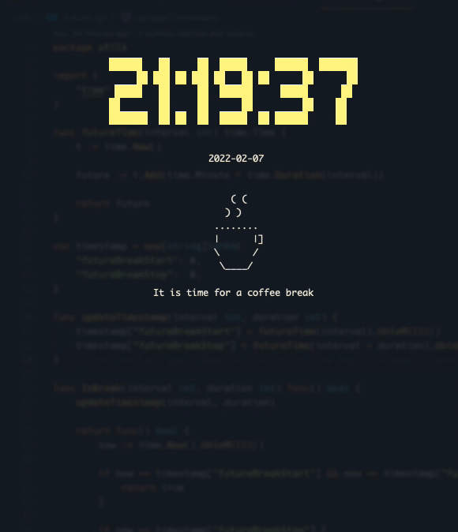

# coffee time

With this cli tool you can set up interval for when you'd like to take a break with a time interval between them, and how long the duration should be. It is really important to take breaks, and it is easy to forget them.

Disclaimer: This is a learning golang project.



## Usage

By assuming you have installed the binary as coffeetime by downloading the binary from <https://github.com/bjarneo/coffeetime/releases>

```bash
coffeetime -interval 45 -duration 5 -color blue
```

### The default values

```bash
-interval 120           The interval in minutes between breaks
-duration 5             The duration in minutes of the break
-color lightYellow      The color of the clock
```

### The available colors

```bash
  red
  cyan
  gray
  blue
  black
  green
  white
  yellow
  magenta

  lightRed
  lightCyan
  lightBlue
  lightGreen
  lightWhite
  lightYellow
  lightMagenta
```

## Download the binary
<https://github.com/bjarneo/coffeetime/releases>

## Get it up and running [DEV]

```bash
# By using the go binary directly
go run cli.go

# By using air you can develop with hot reloading
air
```

Air: [<https://github.com/cosmtrek/air>](https://github.com/cosmtrek/air)

## Compile to binaries

```bash
./build.sh
```

The binaries will be available in the `build/` folder.

## License

MIT [License](./LICENSE)
